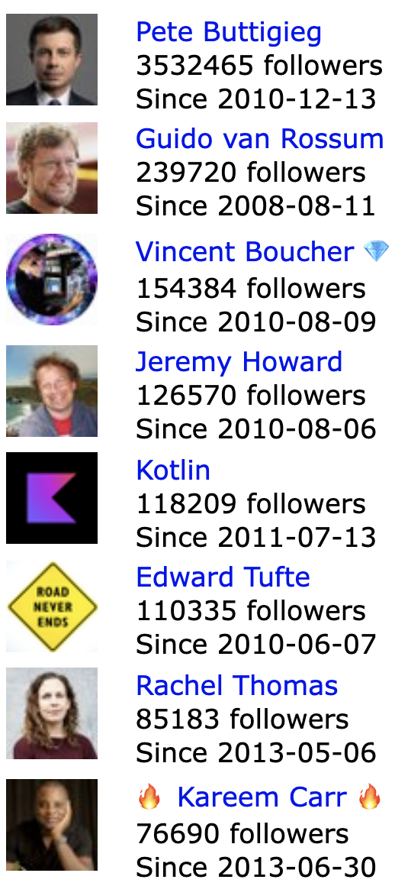

# Twitter-Sentiment-Analysis

## Objective:
The goal of this project is to pull twitter data, using the tweepy wrapper around the twitter API, and perform simple sentiment analysis using the vaderSentiment library.   

It will display the most recent 100 tweets from a given user and the list of users followed by a given user. For example, in response to URL /the_antlr_guy (http://localhost/the_antlr_guy when tested on laptop),it should respond with a tweet list color-coded by sentiment, using a red to green gradient:


And also the application creates a page responding to URLs, such as /following/the_antlr_guy, that displays up to 100 users followed by a given user:



## Installation:
```bash
pip install --upgrade pip
pip install numpy Flask vaderSentiment tweepy
conda install gunicorn
```

## Deployment command

```bash
$ gunicorn -D --threads 4 -b 0.0.0.0:5000 --access-logfile server.log --timeout 60 server:app twitter.csv
```